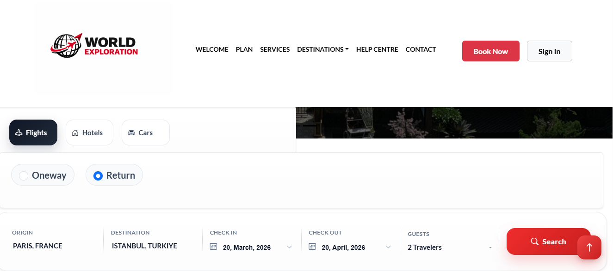
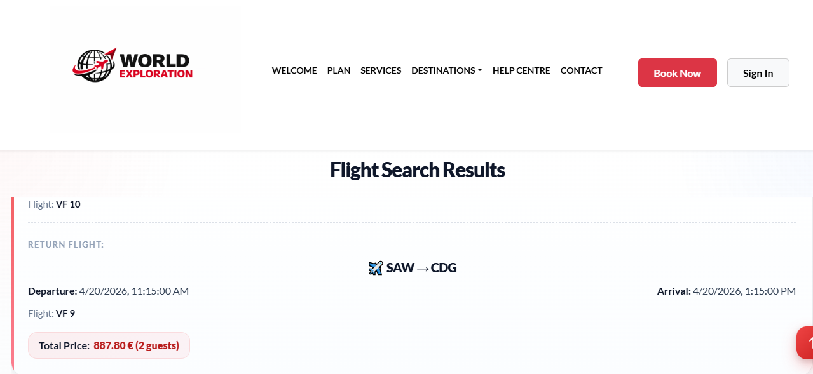
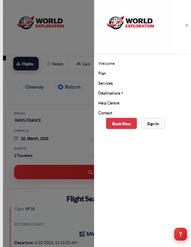

# 🌍 EraTravel

<div align="center">
  <strong>Responsive Travel Booking Platform</strong>
  <br><br>
  
  
  
  
  
</div>

---

## 🌐 Live

👉 [🚀 View Live Project](https://eratravel.site/)

---

## Overview

EraTravel is a modern and responsive travel booking platform built with React.  
It allows users to explore destinations, search for flights, and interact with a clean booking interface designed for both desktop and mobile experiences.

The project focuses on:

- responsive UI implementation
- reusable component structure
- third-party API integration
- clean user experience

---

## Highlights

- Built reusable and scalable React components
- Integrated real-time flight data using external APIs
- Designed responsive UI for both desktop and mobile
- Improved search experience with clean UX patterns

---

## Key Features

- Flight Search & Booking using Amadeus API
- Google Sign-In Authentication
- Responsive UI across devices
- Interactive Destination Cards
- Reusable Components

---

## Tech Stack

- React, Bootstrap 5
- Axios
- Amadeus API
- Google Sign-In
- React Slick, React Select, Datepicker

---

## Screenshots

<div align="center">

<table>
<tr>
<td align="center">
<b>Desktop</b><br/><br/>

</td>

<td align="center">
<b>Form UI</b><br/><br/>

</td>

<td align="center">
<b>Mobile</b><br/><br/>

</td>
</tr>
</table>

</div>

---

## Project Structure

```bash
travel-booking-platform/
├── public/
├── src/
│   ├── components/
│   ├── pages/
│   ├── services/
│   ├── assets/
│   ├── App.js
│   └── index.js
├── package.json
└── README.md
```

---

## Getting Started

```bash
git clone https://github.com/EraCodeX/travel-booking-platform.git
cd travel-booking-platform
npm install
npm start
```

---

## API Integration

- Uses Amadeus API for flight data
- Google Sign-In for authentication

---

## Future Improvements

- Add hotel booking
- Improve filters
- Add favorites
- Deploy live version

---

## Author

**Era Hidaj**  
Frontend Engineer
